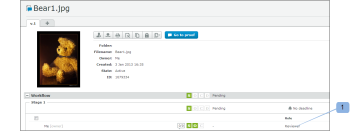
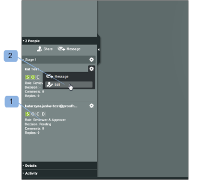

# [!DNL Workfront Proof] でのプルーフの役割の管理

<!-- Audited: 01/2024 -->

>[!IMPORTANT]
>
>この記事では、スタンドアロン製品の [!DNL Workfront Proof] の機能について説明します。[!DNL Adobe Workfront] 内のプルーフについて詳しくは、[プルーフ](../../../review-and-approve-work/proofing/proofing.md)を参照してください。

プルーフの役割を使用すると、ユーザープロファイルに設定された権限プロファイルで制限されているユーザーに権限を付与できます。権限プロファイルについて詳しくは、[ [!DNL Workfront Proof]](../../../workfront-proof/wp-acct-admin/account-settings/proof-perm-profiles-in-wp.md) のプルーフ権限プロファイルを参照してください。

プルーフの役割は、アカウントプロファイルとは異なります。アカウントプロファイルは、アカウントの全体的な権限レベルに関係しており、明示的に共有されていないプルーフも含め、アカウント内のすべてのプルーフに対する権限に影響を与えます。

詳しくは、[ [!DNL Workfront Proof]](../../../workfront-proof/wp-acct-admin/account-settings/proof-perm-profiles-in-wp.md) のプルーフ権限プロファイルを参照してください。

## プルーフの役割について

次のプルーフの役割は、ユーザーがプルーフのレビューに招待されたときに、個々のプルーフのユーザーに付与されます。

* [読み取り専用](#read-only)
* [レビュアー](#reviewer)
* [承認者](#approver)
* [レビュアーと承認者](#reviewer-approver)
* [作者](#author)
* [モデレーター](#moderator)

プルーフの役割では、特定のプルーフに関連してレビュアーが実行できるアクションを定義します。

例えば、レビュアーの場合は、マークアップやコメントを追加してプルーフをレビューするように求められます。レビュアーと承認者を兼任している場合は、プルーフをレビューすると共に判断することを求められます。

特定のプルーフの役割は、（アカウントプロファイルで付与されていない場合でも）プルーフに関する編集権限をレビュアーに付与し、コメントに対するアクションの追加、新しいバージョンの作成、プルーフへのレビュアーの追加などの追加機能をレビュアーが使用できるようにします。

詳しくは、次の記事を参照してください。

* [プルーフのコメントに対するアクションの使用](../../../review-and-approve-work/proofing/reviewing-proofs-within-workfront/comment-on-a-proof/use-actions-on-comments-in-viewer.md)
* [ [!DNL Workfront Proof] でのプルーフの共有](../../../workfront-proof/wp-work-proofsfiles/share-proofs-and-files/share-proof.md)

### 読み取り専用

{#read-only}

 プルーフを表示できる

 マークアップを追加できない

 コメントを追加できない

 決定を下せない

 他のユーザーが作成したコメントを削除できない

 プルーフの編集権限がない

>[!NOTE]
>
>フォルダーが [!DNL Workfront Proof] のユーザーと共有されている場合、そのユーザーには、フォルダー内のすべての既存項目とその後に追加される項目に対する読み取り専用権限が自動的に付与されます。

詳しくは、[ [!DNL Workfront Proof]](../../../workfront-proof/wp-work-proofsfiles/organize-your-work/share-folders.md) でのフォルダーの共有を参照してください。

### レビュアー {#reviewer}

 プルーフを表示できる

 マークアップを追加できる

 コメントを追加できる

![[!DNL cleaner].png](assets/cleaner.png) 返信がない場合は自分のコメントを編集できる

 決定を下せない

 他のユーザーが作成したコメントを編集または削除できない

 プルーフの編集権限がない

### 承認者 {#approver}

 プルーフを表示できる

 決定を下せる

 マークアップを追加できない

 コメントを追加できない

 他のユーザーが作成したコメントを編集または削除できない

 プルーフの編集権限がない

### レビュアーと承認者 {#reviewer-approver}

 プルーフを表示できる

 マークアップを追加できる

 コメントを追加できる

![[!DNL cleaner].png](assets/cleaner.png) 返信がない場合は自分のコメントを編集できる

 決定を下せる

 他のユーザーが作成したコメントを編集または削除できない

 プルーフの編集権限がない

### 作者 {#author}

 マークアップを追加できる

 コメントを追加できる

![[!DNL cleaner].png](assets/cleaner.png) 返信がない場合は自分のコメントを編集できる

 決定を下せる

 新しいバージョンを送信できる

 プルーフのコピーを作成できる

 他のユーザーとプルーフを共有できる

 コメントにアクションを適用できる

 コメントを解決できる

 他のユーザーが作成したコメントを編集または削除できない

>[!NOTE]
>
>この役割は、[!DNL Workfront Proof] のユーザーのみに割り当てることができます。

### モデレーター {#moderator}

 マークアップを追加できる

 コメントを追加できる

![[!DNL cleaner].png](assets/cleaner.png) 返信がない場合は自分のコメントを編集できる

 決定を下せる

 新しいバージョンを送信できる

 新しいレビュアーを追加できる

 コメントにアクションを適用できる

 コメントを解決できる

 プルーフに対するコメントや返信（自分自身または他のユーザーが作成したもの）を削除できる

* コメントスレッド内の最初のコメントを削除すると、スレッド全体が削除されます
* コメントスレッドで返信を削除すると、その返信のみが削除されます

 他のユーザーが作成したコメントを編集できない

この役割を使用すると、プルーフのコメントを管理およびモデレートでき、プルーフに関連するコメントのみを保持し関連しないコメントを削除する機会が与えられます。

>[!NOTE]
>
>この役割は、[!DNL Workfront Proof] のユーザーのみに割り当てることができます。

## プルーフの役割の割り当て

プルーフの役割を割り当てることができるのは、新しいプルーフの作成時、既存のプルーフの新しいバージョンの作成時または既存のプルーフを対象にする場合です。

### 新規プルーフ {#new-proofs}

プルーフの役割は、プルーフ作成プロセス中に[!UICONTROL 新規プルーフ]ページでレビュアーに割り当てることができます（1）。

### 新規バージョン {#new-versions}

配達確認の新しいバージョンを作成すると、以前のバージョンのレビュー担当者が自動的に表示されます（以前のバージョンと同じ役割を持ちます）。

新規バージョンの作成時に、レビュアーに適用されたプルーフの役割を編集できます（1）。

### 既存プルーフ {#existing-proofs}

既存の配達確認に関する個人の役割を変更する場合は、 [!UICONTROL 配達確認の詳細] ページを作成するには、ワークフローの節 (1) での役割をインライン編集します。

## プルーフビューアで役割の確認

レビュアーの役割は、プルーフビューアから直接確認でき (1)、必要に応じて編集できます (2)。

## デフォルトのプルーフの役割

デフォルトのプルーフの役割は、[!DNL Proofing Defaults] ページの個人用設定で設定できます。つまり、プルーフに追加されると、デフォルトのプルーフの役割が自動的に設定されます。この役割は、プルーフに対する編集権限を持つユーザーがプルーフレベルで変更できます。

>[!NOTE]
>
>アカウント内の他のユーザーのプルーフのデフォルトを変更できるのは、管理者または請求管理者のプロファイルを持つユーザーのみです。

詳しくは、[ [!DNL Workfront Proof]](../../../workfront-proof/wp-getstarted/personal-settings/personal-settings.md) の個人用設定を参照してください。

## 作成者と所有者

作成者と所有者には、プルーフに対する完全な編集権限があります。

### 作成者 {#creators}

プルーフ作成者は、最初のインスタンスでプルーフをアップロードするユーザーです。プルーフ作成者は、プルーフのユーザーリスト（のデフォルトの役割）に自動的に表示されます。

[!UICONTROL 新規プルーフ]ページで、プルーフ作成者に別のプルーフの役割を割り当てることができます（デフォルトの役割を除く）。

プルーフ作成者を変更またはプルーフから削除することはできません。

### 所有者 {#owners}

デフォルトでは、作成者もプルーフの所有者ですが、作成者は（[!UICONTROL 新規プルーフ]ページで）最初にプルーフを作成する際に他のユーザーをプルーフの所有者にすることができます。

新規プルーフページで所有者を変更するには、次の手順に従います。

1. 作成者の名前の横に表示される変更リンクをクリックします。
1. ドロップダウンメニューから新しい所有者を選択します。（2）

プルーフを作成した後でも、所有者を変更できます。プルーフの編集権限を持つユーザーなら誰でも、[!UICONTROL プルーフの詳細]ページでプルーフの所有権を別のユーザーに変更できます（以下を参照）。

プルーフの所有者を変更する機能は、ワークフロー管理の観点から特に有用です。これにより、プロジェクトの担当者がプルーフの所有権を引き継いで、プルーフの編集権限を付与され、[!UICONTROL マイプルーフ]ビューにプルーフを表示できるようになります。

[!UICONTROL プルーフの詳細]ページでプルーフの所有者を変更するには、次の手順に従います。

* 所有者にする人の名前の横にある「アクション」メニューをクリックします。
* ドロップダウンメニューから「[!UICONTROL **オーナーにする**]」を選択します。
* または、プルーフ画像の横にある「[!UICONTROL **所有者**]」フィールドをクリックし、表示されるドロップダウンから新しい所有者を選択します。

これが完了すると、その人の名前の横に「所有者」という単語が表示されます。

>[!NOTE]
>
>プルーフの所有者にできるのは、同じアカウントまたはパートナーアカウントのユーザーのみです。パートナーアカウントのユーザーをプルーフの所有者にできるのは、次の場合のみです。
>
>* アカウント間に既存のパートナー関係が設定されている場合。詳しくは、[ [!DNL Workfront Proof]](../../../workfront-proof/wp-acct-admin/partner-accounts/partner-accounts.md) のパートナーアカウントを参照してください。
>* [!UICONTROL 新規プルーフ]ページにカスタムフィールドがない場合。
>* プルーフがフォルダーに割り当てられていない場合。
>* プルーフにタグが適用されていない場合。

[!DNL Workfront Proof] 内でプルーフの所有権を一時的に委任する場合は、[ [!DNL Workfront Proof]](../../../workfront-proof/wp-getstarted/personal-settings/designate-temp-proof-owners.md) での一時的なプルーフ所有者の指定を参照してください。
